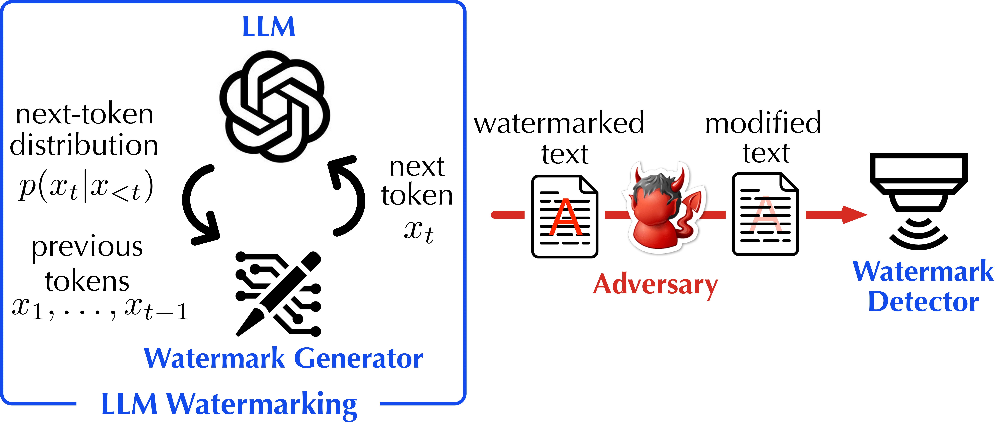

# 🔥 Robustness under Fire: A Red-Team Evaluation of LLM Watermarking


## 🔍 Overview


**WaterPark** is the first **unified platform** for evaluating the robustness of LLM watermarking schemes. It integrates:
- ✅ **10+ watermarking methods**
- 💥 **12+ attack strategies**
- 📊 **8 evaluation metrics**

This repository supports a full pipeline for:
- Watermark injection
- Adversarial removal attacks
- Fidelity and robustness evaluation
- Generic detector training

<p align="center">
  
</p>


## 📦 Setup Instructions

### ✅ Step 1: Create Conda Environment

```bash
conda create -n sokwm python=3.11
conda activate sokwm
cat requirements.txt | xargs -n 1 pip install
```

### 🔑 Step 2: Authenticate WandB

```bash
wandb login
# Paste your WandB key when prompted
```

### 💬 Optional: HuggingFace LLaMA2 Access

If you don’t have access to Meta’s official LLaMA:
- Use fallback model:  
  `https://huggingface.co/daryl149/llama-2-7b-chat-hf`

## 💧 Watermark Injection

Generate watermarked text using different schemes.

Example (using `john23` watermark):
```bash
CUDA_VISIBLE_DEVICES=2,0,1,3 python watermark_reliability_release/generation_pipeline.py   --watermark john23   --dataset_name c4   --run_name gen-c4-john23   --model_name_or_path meta-llama/Llama-2-7b-chat-hf   --min_generations 10   --max_new_tokens 200   --use_sampling False   --generation_batch_size 1   --num_beams 1
```

Run in background:
```bash
nohup python ... &
```

Repeat with other watermarks such as `xuandong23b`, `aiwei23`, etc.

## ⚔️ Attack Phase (Optional)

Test robustness with watermark removal attacks.

Example:
```bash
bash release_shell/attack_john23.sh > release_shell/attack_john23.log 2>&1 &
```

Or direct command:
```bash
CUDA_VISIBLE_DEVICES=2 python watermark_reliability_release/attack_pipeline.py   --run_name dipper-attack-john23-c4   --input_dir ~/sok-llm-watermark/runs/john23/c4   --output_dir ~/sok-llm-watermark/runs/john23/c4/dipper   --attack_method dipper
```

## 🧪 Evaluation Pipeline

Evaluate both clean and attacked generations:

```bash
CUDA_VISIBLE_DEVICES=2 python watermark_reliability_release/evaluation_pipeline.py   --wandb True   --watermark john23   --run_name eva-john23-c4-dipper   --input_dir ~/sok-llm-watermark/runs/john23/c4/dipper   --evaluation_metrics all
```

## 🧠 Generic Detector (Optional)

Train a RoBERTa-based binary classifier to distinguish watermarked and non-watermarked texts:

```bash
python generic_detector/fine_tune_roberta_gpt_data.py   --train_path runs/token_200/john23/c4/opt/dipper_40_o0/gen_table_w_metrics.jsonl   --output_path runs/token_200/john23/c4/opt/dipper_40_o0/dipp_roberta_finetuned_chatgpt_new   --method_name john23
```

## 🧪 Advanced Adversarial Testing

### Gradient-Based Whitebox Attack

```bash
CUDA_VISIBLE_DEVICES=0,1 python whitebox_attack.py --method john23
```

### Multi-GPT Paraphrasing Attack

```bash
bash release_shell/multi-gpt-attack.sh > multi-gpt-attack.log 2>&1 &
```

## 📊 Key Metrics

- **Detection**: ROC AUC, TPR@1%FPR  
- **Fidelity**: WER, BLEU, BERTScore, P-SP  
- **Robustness**: ΔTPR under attack  
- **Quality Degradation**: Text similarity metrics under perturbation

